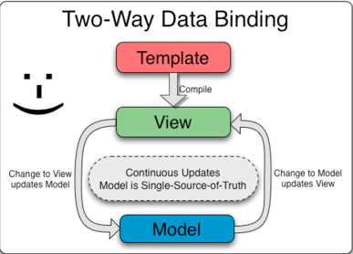

= AngularJs
Doc Writer Javier Rodriguez
:doctype: book
:source-highlighter: coderay
:listing-caption: Listing

Se describe el proceso para trabajar con el proyecto angular basado en node.

== Agregando dependencias

Para agregar una dependencia al proyecto, debemos colocarnos en la ruta donde se
encuentran los archivos del proyecto y ejecutar:

----
bower install [dependencia] --save
Ejemplo: bower install angular-material --save
----
[[bower_install]]
.bower install
image::assets/bower_install_angular_material.png[bower install, align="center"]

* Esto descargará las referencias de angular material, registrará la dependencia
en el archivo bower.json y en el archivo index.html

== Estructura del proyecto

El proyecto web se encuentra dentro del directorio app y contiene:

----
app /
    /images
    /scripts
    /styles
    /views
    index.html
    robots.txt
    404.html
    favicon.ico
----
Donde: +
* *[/images]*: Contiene la estructura de las imagenes incrustadas dentro de la
aplicación web. +
* *[/scripts]*: Contiene todo el código javascript de la aplicación, se encuentran
controller, directivas, servicios y el archivo de arranque de rutas app.js +
* *[/styles]*: Contiene los archivos CSS que aplican los estilos a la solución. +
* *[/views]*: Aquí deberán residir todos los recursos html utilizados por la
aplicación web. +
* *[index.html]*: Archivo html predefinido para la carga de los elementos, este
archivo contiene todas las referencias del proyecto y a su vez carga las
diferentes secciones dentro del mismo para evitar volver a ir por los recursos. +
* *[404.html]*: Recurso utilizado para redirigir peticiones a rutas no
encontradas. +
* *[favicon.ico]*: Imagen que se visualiza en la barra de titulo del navegador. +
* *[robots.txt]*: Funcionará como una petición que especifica que determinados
robots no hagan caso a archivos o directorios específicos.

== Scripts

El directorio de /scripts tiene todo lo necesario para administrar y codificar
en nuestra solución angular.

----
scripts /
        /controllers
        /directives
        /services
        app.js
----
Donde: +
* *[/controllers]*: +
Los archivos controladores son constructores en javascript, que se ejecutan al
cargar una vista (html), y que controlar el comportamiento del DOM. +
* *[/directives]*: +
Las directivas son marcadores que extienden el html, se pueden colocar como:
[source,java]
-----
Atributos:

Elementos:
<directive-example />
CSS class:

-----
* *[/services]*: +
Los servicios son utilizan el patron singleton, y son integrados por inyección
de dependencias. Son usados para compartir información entre controllers y para
reutilizar código.
* *[app.js]*: +
Modulo javascript que inicializa la aplicación, se definen las rutas, vistas y
controladores y se registran los modulos que los mismo utilizarán.

== Binding

Una de las caracteristicas principales de angular es el binding, en angular la
vista y el controlador utilizan un binding two-way de la siguiente manera:

[[binding]]
.two way data binding

== Plugins text editor

En la nube existen distintos tipos de plugins para el mejor control de código
javascript, html, css, etc. se enlistan algunos de los mas comúnes y útiles.

* *linter-jshint* +
This plugin for linter provides an interface to JSHint. It will lint JavaScript
in files with the .js extension and optionally inside <script> blocks in HTML or
PHP files.

* *atom-beautify* +
Beautify HTML, CSS, JavaScript, PHP, Python, Ruby, Java, C, C++, C#,
Objective-C, CoffeeScript, TypeScript, Coldfusion, SQL, and more in Atom.
