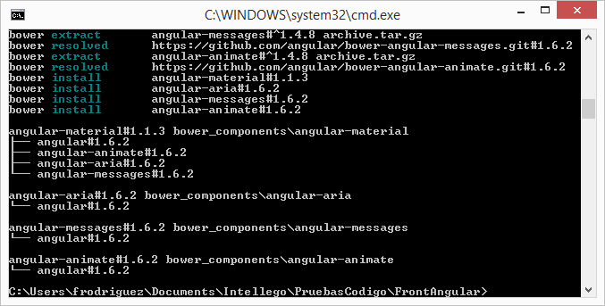

= AngularJs
Doc Writer Javier Rodriguez
:doctype: book
:source-highlighter: coderay
:listing-caption: Listing

Se describe el proceso para trabajar con el proyecto angular basado en node.

== Agregando dependencias

Para agregar una dependencia al proyecto, debemos colocarnos en la ruta donde se
encuentran los archivos del proyecto y ejecutar:

----
bower install [dependencia] --save
Ejemplo: bower install angular-material --save
----
[[img-sunset]]
.bower install

* Esto decargara las referencias de angular material, registrará la dependencia
en el archivo bower.json y en el archivo index.html

== Plugins text editor

En la nube existen distintos tipos de plugins para el mejor control de código
javascript, html, css, etc. se enlistan algunos de los mas comúnes y útiles.

* linter-jshint
This plugin for linter provides an interface to JSHint. It will lint JavaScript
in files with the .js extension and optionally inside <script> blocks in HTML or
PHP files.

* atom-beautify
Beautify HTML, CSS, JavaScript, PHP, Python, Ruby, Java, C, C++, C#,
Objective-C, CoffeeScript, TypeScript, Coldfusion, SQL, and more in Atom.
